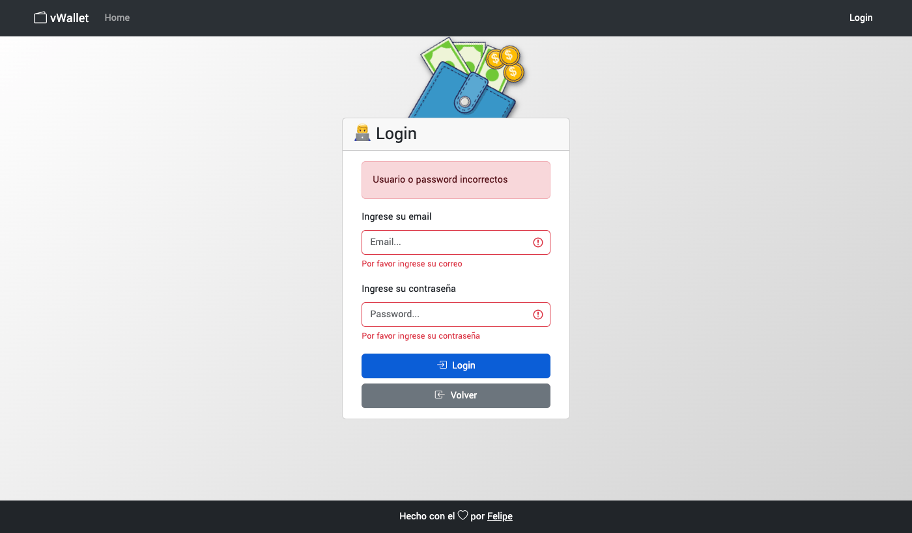
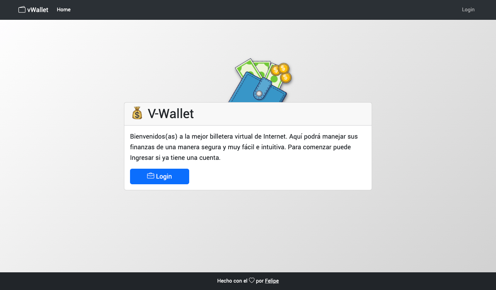
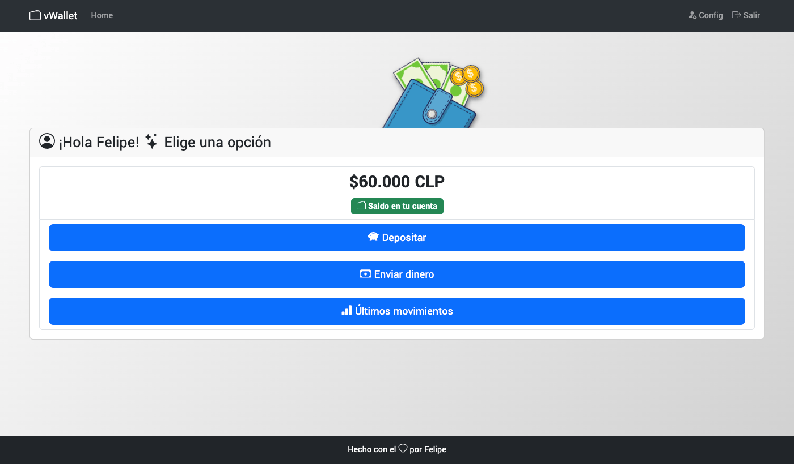
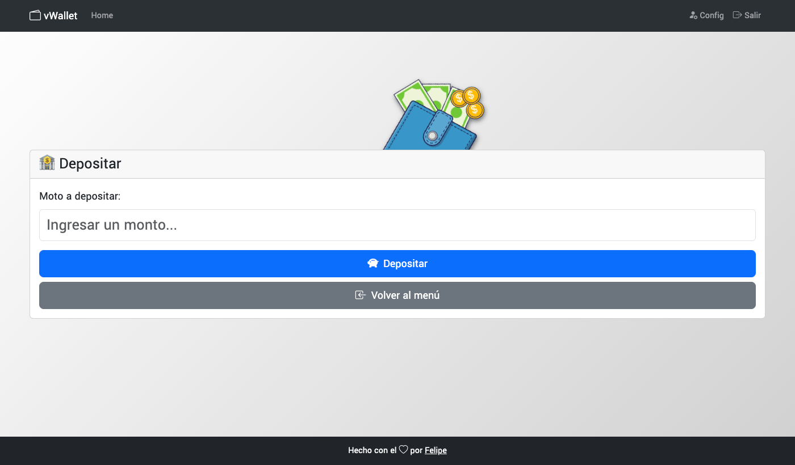
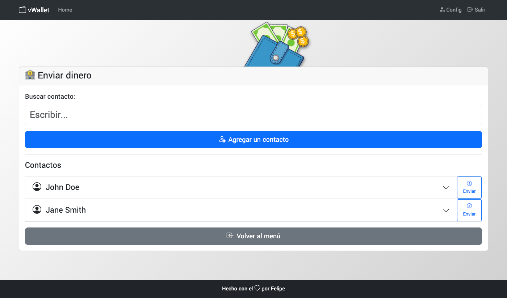
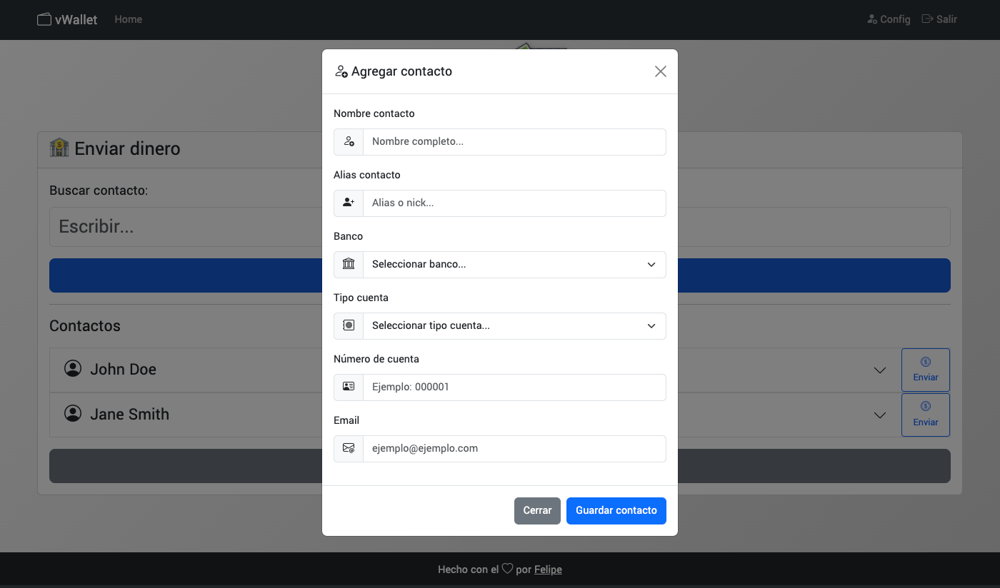
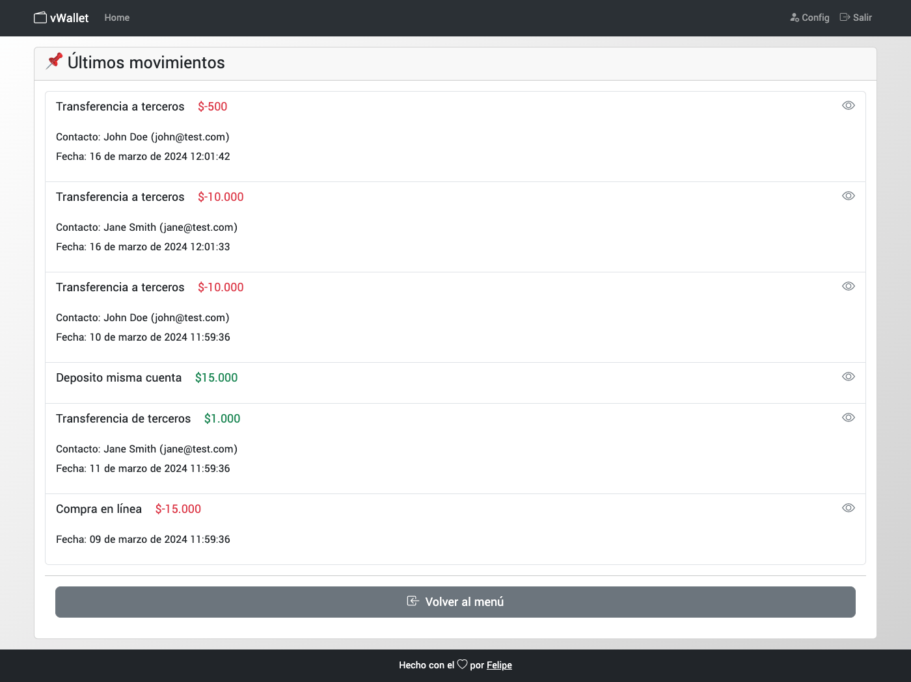

# 💰 V-Wallet

Este proyecto contiene una maqueta hecha con herramientas básicas para la creación de interfaces web que busca representar un producto de billetera virtual con el mínimo de funcionalidades.

> Datos de pruebas

- user: test@test.com pass: 123123
- user: isaura@test.com pass: 123123
- user: cesar@test.com pass: 123123

[Vista previa online](https://felipejoq.github.io/v-wallet-ui/)

## Capturas

